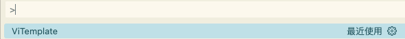
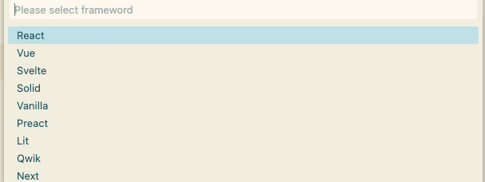
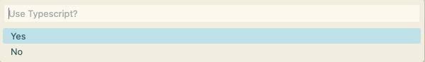
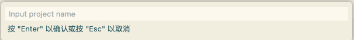

# ViTemplate README

## Features

This extension provides a visualization step way to create project by using Vite to build. Support React, Vue, Svelte, Solid, Vanilla, Preact, Lit and Qwik, also Next, and support Typescript.

\!\[feature X\]\(images/feature-x.png\)

> Note: All the framework and Vite default using the latest version.

## Requirements

- Node version > 18

## How to use

**Cmd + Shift + P on Mac** or **Ctrl + Shift + P on Windows** to launch, then search with **ViTemplate**

## Release Notes

### 1.0.0

Initial release

### 1.0.1

Add more framework support

