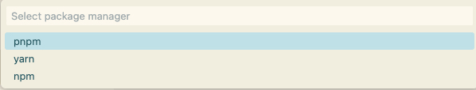

 

## Features

This extension provides a way to create project template by using Vite scaffold step by step. Support React, Vue, Svelte, Solid, Vanilla, Preact, Lit and Qwik, also Next (not use Vite but Next official command script).

> Note: All the framework and Vite default using the latest version.

## Requirements

- Node version > 18 or > 20

## How to use

**Cmd + Shift + P on Mac** or **Ctrl + Shift + P on Windows** to launch, then search with **ViTemplate**

